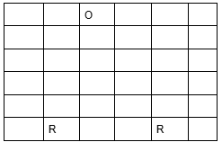

Exercício Divisão e Conquista - Robôs de Busca de Objetos

Suponha que você precisa programar  um conjunto de robôs que devem encontrar um objeto físico em uma área representada por um espaço cartesiano. 
Neste sentido, suponha que cada robô será representado por um caractere ‘R’ em uma matriz. O objeto será representado pelo caractere ‘O’, os espaços vazios devem estar associados com o caractere "_". Os robôs podem se mover apenas uma "casa" em todas as direções (cima, esquerda, direita e diagonais). Para detectar o objeto, os robôs são equipados com sensores que detectam obstáculos ao seu redor (casas vizinhas).
Suponha que os robôs devem iniciar em posições da borda inferior do tabuleiro.

O tamanho do cenário (matriz) e o número de robôs devem ser passados como parâmetro para o algoritmo.

Suponha que os robôs vão rodar em paralelo.

Implemente uma solução para o problema aplicando uma estratégia de Divisão e Conquista.
Observe que, neste caso, o algoritmo não precisa ser recursivo - vamos trabalhar a estratégia de dividir o espaço de processamento

Exemplo de aplicação: 2 robôs buscando um objeto em um cenário 6x6.

